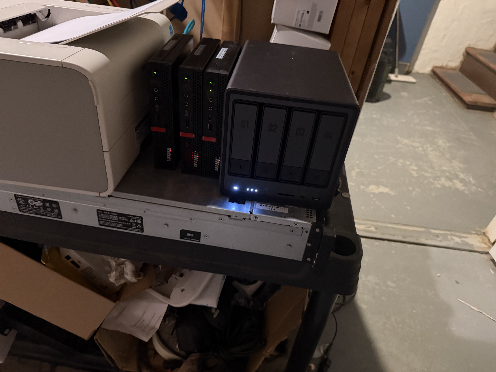

## TL;DR

The media stack is now fully automated: content gets sourced, synced from a remote seedbox to the local NAS via an rclone CronJob, organized by Radarr/Sonarr, and served by Jellyfin with Intel iGPU hardware transcoding. I also deployed a Media Controller for lifecycle management and a Media Profiler for content analysis. This post covers the full pipeline from acquisition to playback.


## The Media Pipeline

```
Jellyseerr (request)
       │
       ▼
Radarr/Sonarr (search + organize)
       │
       ▼
Prowlarr (indexer management)
       │
       ▼
Seedbox (remote acquisition)
       │
       ▼
rclone-sync CronJob (seedbox → NAS)
       │
       ▼
NAS (TrueNAS, VLAN 30)
       │
       ▼
Jellyfin (playback + GPU transcode)
```

Each component runs as a Kubernetes deployment in the `media` namespace.

## Jellyfin with GPU Transcoding

Jellyfin is the centerpiece of the media stack. What makes it special in this setup is hardware transcoding via Intel UHD 630 iGPU passthrough.

### The GPU Pipeline

1. **Proxmox host** (pve-3): IOMMU enabled, i915 blacklisted, VFIO modules loaded
2. **k3s-agent-3 VM**: q35 machine type, OVMF BIOS, GPU passed through as `hostpci0`
3. **Jellyfin pod**: `/dev/dri/renderD128` device mounted for VA-API access

```yaml
apiVersion: apps/v1
kind: Deployment
metadata:
  name: jellyfin
  namespace: media
spec:
  template:
    spec:
      nodeSelector:
        gpu: intel-uhd-630
      containers:
      - name: jellyfin
        image: jellyfin/jellyfin:latest
        securityContext:
          privileged: true
        volumeMounts:
        - name: media
          mountPath: /media
          readOnly: true
        - name: config
          mountPath: /config
        devices:
        - /dev/dri/renderD128
      volumes:
      - name: media
        nfs:
          server: 192.168.30.10
          path: /mnt/pool/media
```

The `gpu: intel-uhd-630` label ensures Jellyfin lands on the node with the passed-through GPU. The `privileged` security context is required for device access.

### Transcoding Performance

With hardware transcoding enabled, the Intel UHD 630 handles:

- **H.264**: Real-time encode/decode at 4K
- **HEVC (H.265)**: Real-time decode, encode up to 1080p
- **VP9**: Decode only (encode not supported by this generation)

Without hardware transcoding, a single 4K HEVC stream would peg all 6 CPU cores. With the iGPU, CPU usage stays under 10% during transcoding. This is the difference between supporting 1 stream and supporting 5+ simultaneous streams.



## The *arr Suite

### Radarr and Sonarr

Radarr (movies) and Sonarr (TV) manage the media library:

- Monitor for new releases matching quality profiles
- Track what is in the library and what is wanted
- Rename and organize files according to naming conventions
- Send notifications when new content is available

Both services need NFS access to the media library on the NAS:



```yaml
volumes:
- name: media
  nfs:
    server: 192.168.30.10
    path: /mnt/pool/media
- name: downloads
  nfs:
    server: 192.168.30.10
    path: /mnt/pool/downloads
```

### The Lima Node Problem

One of the more frustrating bugs: the arm64 node (Lima) does not support NFS client mounts because the NFS kernel modules are not available in its VM configuration. When Radarr or Sonarr got scheduled on Lima, the NFS mount failed and the pod crashed.

The fix: nodeAffinity excluding Lima:

```yaml
affinity:
  nodeAffinity:
    requiredDuringSchedulingIgnoredDuringExecution:
      nodeSelectorTerms:
      - matchExpressions:
        - key: kubernetes.io/hostname
          operator: NotIn
          values: ["lima"]
```

### Prowlarr

Prowlarr centralizes indexer management. Instead of configuring indexers separately in Radarr and Sonarr, Prowlarr manages them all and syncs the configuration. This means adding or removing an indexer is a single change.

### Jellyseerr

Jellyseerr provides a user-friendly request interface. Users can search for movies or TV shows and submit requests, which Jellyseerr forwards to Radarr or Sonarr. This is the frontend for the entire media pipeline.

## rclone-sync: Automated Seedbox Sync

Content acquired on a remote seedbox needs to reach the local NAS. I created a Kubernetes CronJob that runs rclone to sync completed content:

```yaml
apiVersion: batch/v1
kind: CronJob
metadata:
  name: rclone-sync
  namespace: media
spec:
  schedule: "*/30 * * * *"
  jobTemplate:
    spec:
      template:
        spec:
          containers:
          - name: rclone
            image: rclone/rclone:latest
            command:
            - rclone
            - sync
            - seedbox:/data/completed/
            - /mnt/downloads/
            - --transfers=4
            - --checkers=8
            - --bwlimit=50M
            - --log-level=INFO
            volumeMounts:
            - name: downloads
              mountPath: /mnt/downloads
            - name: rclone-config
              mountPath: /config/rclone
          restartPolicy: OnFailure
          volumes:
          - name: downloads
            nfs:
              server: 192.168.30.10
              path: /mnt/pool/downloads
          - name: rclone-config
            secret:
              secretName: rclone-config
```

The CronJob runs every 30 minutes, syncing completed content from the seedbox to the NAS downloads directory. rclone handles interrupted transfers, checksumming, and bandwidth limiting.

### Bandwidth Management

The `--bwlimit=50M` flag caps sync bandwidth at 50 MB/s. This prevents the sync from saturating the internet connection and impacting other services. During off-peak hours, this could be increased.

## Media Controller

The Media Controller is a custom service that automates media lifecycle operations:

- **Import monitoring**: Watches the downloads directory and triggers Radarr/Sonarr to import completed content
- **Cleanup**: Removes source files after successful import
- **Notifications**: Posts to Slack when new content is available
- **Quality upgrades**: Monitors for higher-quality releases and triggers replacement

## Media Profiler

The Media Profiler analyzes the media library:

- **Codec analysis**: Identifies files using inefficient codecs that would benefit from transcoding
- **Quality distribution**: Shows the breakdown of 720p/1080p/4K content
- **Storage trending**: Projects storage utilization based on growth rate
- **Health checks**: Identifies corrupted files, missing subtitles, or orphaned entries

Both the Controller and Profiler are integrated into the cluster dashboard for at-a-glance status.

## Monitoring the Pipeline

### Exportarr Sidecars

Each *arr service runs an Exportarr sidecar that exposes metrics to Prometheus:

```yaml
- name: exportarr
  image: ghcr.io/onedr0p/exportarr:latest
  args: ["radarr"]
  env:
  - name: URL
    value: "http://localhost:7878"
  - name: APIKEY
    valueFrom:
      secretKeyRef:
        name: radarr-api
        key: key
  ports:
  - containerPort: 9707
```

Grafana dashboards show:

- Queue depth per service
- Download completion rates
- Library size growth over time
- Failed import counts (alert trigger)

### Seedbox and NAS Exporters

Custom Prometheus exporters for the seedbox and NAS provide metrics on:

- Disk usage and available space
- Active transfer counts
- Network throughput
- rclone sync status (last run time, bytes transferred, errors)


## Lessons Learned

1. **GPU passthrough transforms Jellyfin.** Without hardware transcoding, a single 4K stream maxes the CPU. With the iGPU, you get 5+ simultaneous streams with minimal CPU usage.
2. **NFS node compatibility is not universal.** Check that all nodes support NFS before deploying NFS-dependent workloads. Use nodeAffinity to exclude incompatible nodes.
3. **rclone CronJobs are reliable.** Running rclone as a Kubernetes CronJob with bandwidth limiting and retry logic is production-grade file sync.
4. **Monitor the monitoring.** Exportarr sidecars add minimal overhead but provide crucial visibility into the media pipeline health.

The complete media pipeline is now operational — from request to playback, fully automated, running on Kubernetes.
