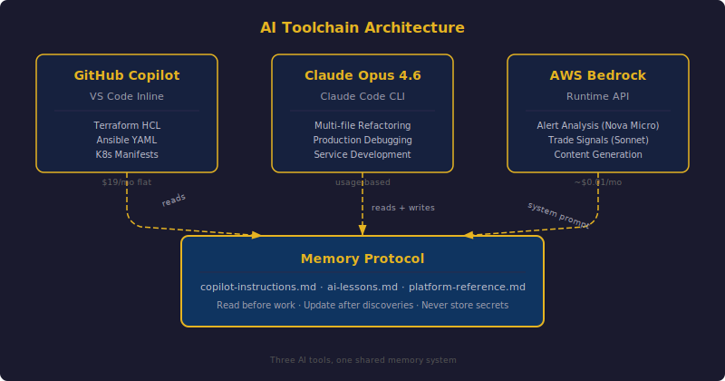
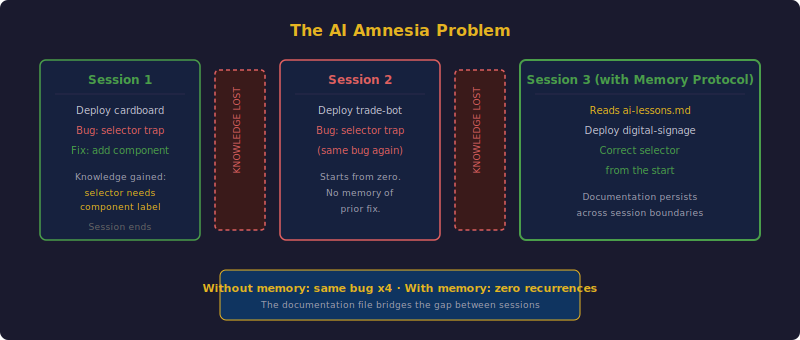
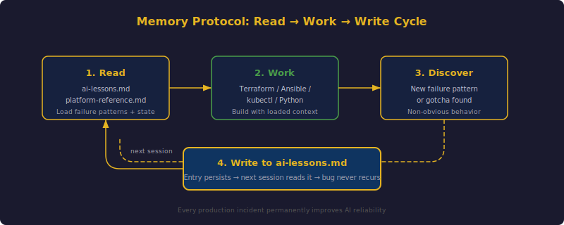

## TL;DR

Two weeks of building a production Kubernetes cluster with AI pair programming. Claude Opus 4.6 handles complex multi-step infrastructure work via the CLI. GitHub Copilot provides inline code completion in VS Code. AWS Bedrock (Nova Micro, Claude Sonnet 4.5) powers runtime AI services inside the cluster. The key discovery: AI tools without persistent memory are dangerous. Every session starts from zero. The same bugs get recreated, the same anti-patterns get suggested, the same cluster-specific constraints get forgotten. The solution is the "Memory Protocol" -- a set of documentation files the AI reads before every session and updates after every discovery.


## The AI Toolchain

This cluster was built almost entirely with AI assistance. Not as an experiment -- as a deliberate engineering choice. Here is what each tool does and where it fits.



### GitHub Copilot

GitHub Copilot runs inside VS Code and provides inline code completion. It is aware of the current file, open tabs, and -- critically -- the `.github/copilot-instructions.md` file in the repository root. That file tells Copilot about the project's architecture, conventions, and anti-patterns.

Copilot excels at:
- Terraform HCL completion (it knows the `bpg/proxmox` provider's syntax)
- Ansible YAML tasks (it picks up the idempotency patterns from surrounding code)
- Boilerplate Kubernetes manifests (Deployments, Services, Ingress)
- Shell script idioms (`set -euo pipefail`, argument parsing)

Where it struggles: multi-file refactoring, debugging production issues, anything that requires reasoning across the full repository.

### Claude Opus 4.6

Claude Opus 4.6, accessed via the Claude Code CLI tool, is the heavy lifter. It reads the full codebase, edits files, runs commands, and maintains context across a complex multi-step task within a single session. This is the tool that:

- Wrote the Terraform modules for Proxmox VM provisioning
- Debugged the kube-router NetworkPolicy iptables chain that was silently dropping traffic
- Built the entire media stack deployment (Jellyfin, Radarr, Sonarr, Prowlarr, Bazarr)
- Implemented the Proxmox watchdog service with smart power strip integration
- Diagnosed the Mellanox ConnectX-3 firmware brick and wrote the recovery procedure

Claude Code operates as a pair programmer that can also execute. It reads a file, proposes a change, makes the edit, runs the test, reads the error, and iterates. For infrastructure work where the feedback loop involves `kubectl apply`, `terraform plan`, and `ansible-playbook`, this tight loop is extremely productive.

### AWS Bedrock

Bedrock provides AI models as a managed service inside AWS. I use two model tiers:

- **Amazon Nova Micro** ($0.035/M input tokens): Powers the alert responder that analyzes Prometheus alerts and suggests remediation in Slack. At 50 alerts per day, it costs less than $0.01/month. Speed matters here -- responses come back in under 2 seconds.
- **Claude Sonnet 4.5** (via Bedrock): Powers the trade bot's AI analysis tier for complex market pattern recognition. Higher cost, but only invoked for non-trivial analysis that the local rule engine cannot handle.

The tiering is deliberate. Not every AI task needs a frontier model. Alert analysis with good context is a perfect use case for a small, fast, cheap model.

### Comparison

| Dimension | GitHub Copilot | Claude Opus 4.6 | AWS Bedrock |
|-----------|---------------|-----------------|-------------|
| **Interface** | VS Code inline | CLI / terminal | API (runtime) |
| **Scope** | Current file + tabs | Full repository | Per-request |
| **Best for** | Code completion | Complex multi-step tasks | Runtime AI services |
| **Memory** | copilot-instructions.md | CLAUDE.md + session context | System prompt per request |
| **Cost** | $19/month | Usage-based | Per-token |
| **Latency** | Milliseconds | Seconds | 1-2 seconds |

## The Problem: AI Amnesia

The first few days were exhilarating. AI tools accelerated everything. A Terraform module that would have taken hours of provider documentation reading was done in 20 minutes. An Ansible playbook for k3s cluster formation -- complete with etcd HA, token management, and agent join logic -- materialized in a single session.

Then the problems started.



### The Same Bug, Three Times

On day 4, I deployed the Cardboard application (a TCG price tracker). It has a Flask web app and a PostgreSQL database in the same namespace. The AI wrote the Kubernetes Service with this selector:

```yaml
selector:
  app.kubernetes.io/name: cardboard
```

Both the web pod and the PostgreSQL pod had the `app.kubernetes.io/name: cardboard` label. The Service load-balanced across both. Roughly 50% of HTTP requests hit PostgreSQL instead of Flask, returning 502 Bad Gateway.

I fixed it by adding `app.kubernetes.io/component: web` to the selector. The AI learned -- for that session. Two days later, deploying the trade bot (same pattern: Flask + PostgreSQL), the AI made the exact same mistake. And again with the digital signage app.

The bug appeared four separate times before I realized the core issue: **AI has no memory between sessions.**

### Other Recurring Failures

- The AI used `actions.summerwind.net` for ARC CRDs instead of `actions.summerwind.dev` -- a copy-paste error from outdated documentation. It did this in three different workflow files.
- It mounted ConfigMaps directly over paths that init scripts needed to modify, causing "Resource busy" errors. This happened with code-server, Home Assistant, and the alert responder.
- It forgot that the cluster has an arm64 node (the Mac Mini running Lima) and wrote Deployments without `nodeSelector` for architecture. Pods would get scheduled on the arm64 node and crash with `exec format error`.
- It suggested `metallb.universe.tf/address-pool: default` which fails silently. The correct behavior is to omit the annotation entirely.

Each of these bugs was fixed and then recreated in a later session. The AI was productive but unreliable. It had no institutional memory.

## The Memory Protocol

The solution crystallized during the VLAN migration on day 10. The migration involved changing every node's IP address, updating etcd peer URLs, regenerating TLS certificates, and coordinating a rolling restart across 7 nodes. It was the most complex operation I had attempted, and I could not afford the AI to make a mistake it had made before.



I wrote a protocol:

```
Before infrastructure changes: read docs/ai-lessons.md for failure patterns
and docs/platform-reference.md for current state. After significant work:
update the relevant docs/ file if new knowledge was discovered.
Never store secrets or credentials.
```

This four-line protocol became the foundation of the entire AI documentation system. It codifies three principles:

1. **Read before work.** The AI must load context about known failure patterns and current cluster state before making any changes.
2. **Write after discoveries.** When a new non-obvious failure pattern is found, it gets documented immediately. The documentation grows with every incident.
3. **Never store secrets.** AI documentation files live in git. Secrets do not.

### copilot-instructions.md

The `.github/copilot-instructions.md` file is the AI's "operating system" for the repository. Both GitHub Copilot and Claude Code read this file automatically. It contains:

- **Platform Identity**: 7 nodes, 3 control plane, 3 workers, 1 Mac Mini. Proxmox VE + k3s. DNS pattern. GitHub org.
- **Engineering Principles**: Infrastructure as code. Declarative over imperative. Idempotent. Least privilege. Observable by default.
- **Architecture Philosophy**: Traefik is the sole ingress controller. MetalLB for LoadBalancer IPs. Longhorn for distributed storage. cert-manager for TLS.
- **High-Impact Anti-Patterns**: The 8 most dangerous recurring bugs, each documented with symptom, root cause, and fix.
- **Reference Lookup**: A table mapping "what you need" to "where to find it" across the documentation files.

This file is 99 lines. Every line exists because its absence caused a production incident.

### docs/ai-lessons.md

This is the living database. Every failure pattern that is non-obvious gets an entry. The format is consistent: **bold symptom**, explanation of root cause, fix. Currently 482 lines across 20+ categories:

- Kubernetes (40+ entries)
- ARC / GitHub Actions (14 entries)
- MetalLB (3 entries)
- Networking & DNS (15 entries)
- AWS & Terraform (6 entries)
- Observability & Alerting (16 entries)
- Alert Responder agent failures (14 entries)
- And more

The file grows after every significant debugging session. It is the cluster's institutional memory, externalized into a format that AI tools can consume.

## Early Wins

With the Memory Protocol in place, AI-assisted infrastructure development became dramatically more reliable. Some highlights:

### Terraform Provider Quirks

The `bpg/proxmox` Terraform provider has several counterintuitive field names. The `hostpci` block uses `device` for the PCI slot name and `id` for the PCI address -- the opposite of what you would expect. The `efi_disk` block requires `file_format` and `pre_enrolled_keys` even though the documentation does not emphasize them. Cloud-init changes cannot be hotplugged. All of these quirks are now documented in `ai-lessons.md`, and the AI gets them right on the first attempt.

### NetworkPolicy Debugging

The kube-router NetworkPolicy investigation was a masterclass in AI-assisted debugging. Postgres backup jobs were failing with "no response" when connecting to PostgreSQL. The AI traced the issue through:

1. `kubectl exec` into the postgres pod -- works (same-pod, no NetworkPolicy check)
2. `kubectl run` a debug pod -- "no response" (different pod, subject to NetworkPolicy)
3. `nc` from the host -- "Connection refused" (TCP RST, not timeout)
4. `iptables -L FORWARD -n` -- revealed `KUBE-ROUTER-FORWARD` chain

The root cause: kube-router was enforcing NetworkPolicies, and the backup pods had no egress policy. The AI identified the fix (a NetworkPolicy allowing egress from `app.kubernetes.io/name: postgres-backup` pods) in a single session. Without AI, this would have been hours of iptables chain tracing.

### Prometheus Relabeling

The Prometheus scrape configuration for Traefik had a subtle relabeling bug. The source label `__meta_kubernetes_pod_annotation_prometheus_io_port` was used as the sole source for `__address__`, producing `9100:9100` (port:port) instead of `ip:port`. The AI identified the fix: use two source labels with `regex: (.+);(.+)` and `replacement: ${1}:${2}`. This is exactly the kind of bug that takes 30 minutes of Prometheus documentation reading to solve manually.

## Further Reading

The intersection of AI tools and infrastructure engineering is still early, but several writers are documenting their experiences:

- Simon Willison has written extensively about [using LLMs for code](https://simonwillison.net/2025/Mar/11/using-llms-for-code/), including his process for working with coding agents and the importance of testing AI-generated output.
- Mitchell Hashimoto documented his [AI adoption journey](https://mitchellh.com/writing/my-ai-adoption-journey) -- the progression from skepticism to daily usage for Go development.
- Anthropic's documentation on [CLAUDE.md files](https://code.claude.com/docs/en/claude-md) describes the project memory pattern that aligns closely with the Memory Protocol approach.
- Honeycomb published a practical guide on [measuring Claude Code ROI and adoption](https://www.honeycomb.io/blog/measuring-claude-code-roi-adoption-honeycomb), using OpenTelemetry to track AI coding tool effectiveness.

## Lessons Learned

1. **AI without memory is a liability.** A powerful model that recreates known bugs is worse than no AI at all, because it creates false confidence. The Memory Protocol -- read before work, write after discoveries -- is the minimum viable solution.
2. **Different AI tools for different scopes.** Copilot for inline completion, Claude Code for multi-step infrastructure work, Bedrock for runtime services. Trying to force one tool into all roles wastes money and produces worse results.
3. **The copilot-instructions file is the highest-leverage documentation in the repository.** Ninety-nine lines that prevent dozens of recurring bugs. It is read by both human engineers and AI assistants.
4. **Model tiering saves money without sacrificing quality.** Nova Micro at $0.035/M tokens handles alert analysis just as well as a frontier model. Match the model to the task complexity.
5. **AI excels at pattern-matching across documentation.** The Prometheus relabeling bug, the kube-router NetworkPolicy chain, the Terraform provider quirks -- these are all problems where the answer exists in documentation but is hard to find. AI collapses the search time.
6. **Every session teaches the AI something it will immediately forget.** Unless you externalize that knowledge into files the AI reads at the start of the next session. The docs/ directory is not optional infrastructure documentation. It is the AI's long-term memory.
