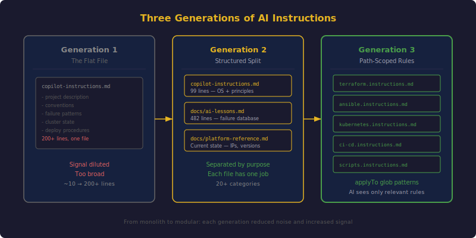
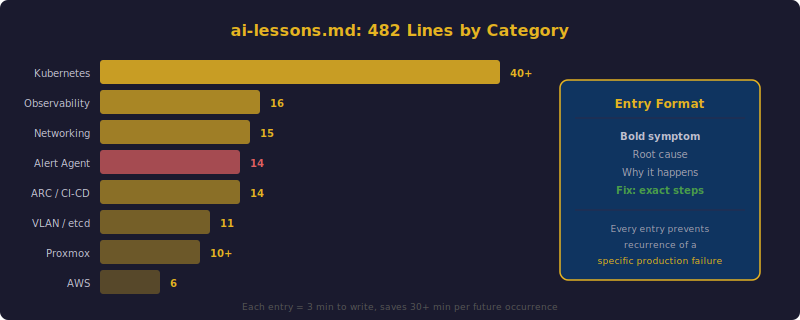

## TL;DR

The `.github/copilot-instructions.md` file started as 10 lines of project description and grew into a 99-line "operating system" for AI assistants. Then it split: failure patterns moved into `docs/ai-lessons.md` (now 482 lines across 20+ categories), and file-type-specific rules moved into `.github/instructions/` with `applyTo` glob patterns. The same template structure was standardized across 5 repositories. This post traces the three generations of AI instruction architecture and shows how every production incident permanently improves AI reliability.



## Generation 1: The Flat File

When I started using GitHub Copilot for the infrastructure repository, the `.github/copilot-instructions.md` file looked like this:

```markdown
# Home K3s Cluster

Proxmox VE + k3s Kubernetes cluster. 3 nodes. Terraform for provisioning,
Ansible for configuration, kubectl manifests for workloads.

- Use bpg/proxmox provider for Terraform
- Ansible playbooks must be idempotent
- All manifests live in kubernetes/apps/<app-name>/
```

Ten lines. It was enough for the AI to know it was working on a Kubernetes project with Terraform and Ansible. But it was not enough to prevent mistakes.

### The Growth Problem

Every time the AI made a mistake that I caught, I added a note:

```markdown
- Service selectors must include app.kubernetes.io/component when PostgreSQL
  shares the namespace
- ARC labels field replaces defaults -- always include self-hosted explicitly
- ConfigMaps cannot be mounted over paths that init scripts modify
```

Within a week, the file was 200+ lines. It covered Terraform provider quirks, Ansible conventions, Kubernetes anti-patterns, CI/CD pipeline rules, networking gotchas, and storage constraints. Everything was in one flat list. The signal was diluted. The AI would read the file but miss critical entries because they were buried among dozens of less important notes.

The flat file had another problem: it tried to be everything. It described the project, set coding conventions, documented failure patterns, listed current infrastructure state, and defined deployment procedures. When I needed to update the cluster's IP addresses after a VLAN migration, I had to hunt through a wall of unrelated text.

## Generation 2: The Living Database

The breakthrough was splitting the documentation by purpose.

### copilot-instructions.md: The Operating System

I extracted everything that was not a failure pattern and organized it into sections:

```markdown
## Memory Protocol
Before infrastructure changes: read docs/ai-lessons.md for failure patterns
and docs/platform-reference.md for current state. After significant work:
update the relevant docs/ file if new knowledge was discovered.
Never store secrets or credentials.

## Platform Identity
Private cloud running Proxmox VE + k3s Kubernetes. 7 nodes: 3 control
plane, 3 workers (amd64 Debian 13 VMs), 1 Mac Mini (arm64, Lima VM
running Debian 13). All infrastructure managed via Terraform, Ansible,
and Lima. GitHub org: zolty-mat. DNS: *.k3s.internal.strommen.systems.

## Engineering Principles
- Infrastructure as Code first
- Declarative over imperative
- GitOps-aligned
- Idempotent
- Least privilege
- Observable by default

## High-Impact Anti-Patterns
1. Service selector trap
2. ARC label replacement
3. ConfigMap immutability
4. MetalLB pool annotation
5. ECR token expiry
6. UFW blocks VXLAN for new nodes
7. LACP switch-before-client = NAS crash
8. NetworkPolicy namespaceSelector vs host-network IPs

## Reference Lookup
| What you need              | Where to find it          |
|----------------------------|---------------------------|
| IPs, nodes, versions       | docs/platform-reference.md|
| Failure patterns           | docs/ai-lessons.md        |
| New service deployment     | docs/new-service-checklist|
```

The file became a table of contents and a set of principles. It tells the AI *what kind of project this is* and *where to find everything else*. The anti-patterns section is deliberately short -- just the names and one-line descriptions. Full details live in `ai-lessons.md`.

### ai-lessons.md: The Failure Database

This is the heart of the system. Every non-obvious failure pattern gets an entry following a consistent format:

```markdown
- **Bold symptom description**: Explanation of root cause, why it happens,
  and what happens if you get it wrong. Fix: specific remediation steps
  with exact commands.
```



The file is organized by category. Here is what 482 lines looks like by the numbers:

| Category | Entries | Example |
|----------|---------|---------|
| Kubernetes | 40+ | Service selector trap, Longhorn I/O corruption recovery |
| ARC (GitHub Actions) | 14 | Label replacement, RBAC escalation, rollout timeouts |
| Networking & DNS | 15 | VXLAN firewall blocking, LACP order-of-operations |
| Observability | 16 | Prometheus disk full, high-cardinality buckets |
| Alert Responder | 14 | Pod name guessing, namespace confusion |
| AWS & Terraform | 6 | ECR token expiry, state locking |
| VLAN Migration & etcd | 11 | Peer URL in etcd data, TLS cert newer than datastore |
| Proxmox & Hardware | 10+ | ConnectX-3 firmware flash, e1000e hang |

### The #1 Entry: Service Selector Trap

The service selector trap is the single most important entry in the file. It appears in 4 separate instruction files because it is the most common AI mistake in this cluster:

```markdown
- **Service selector with shared namespace PostgreSQL**: Service selector
  using only `app.kubernetes.io/name` matches BOTH app pod and postgres
  pod -> 50% of requests get 502 Bad Gateway. ALWAYS include
  `app.kubernetes.io/component: web`.
```

This entry exists in:
1. `ai-lessons.md` (Kubernetes section) -- full explanation
2. `copilot-instructions.md` (High-Impact Anti-Patterns) -- short reference
3. `.github/instructions/kubernetes.instructions.md` -- activated when editing manifests
4. `cardboard/.github/copilot-instructions.md` -- inherited by the repo that first triggered it

Four redundant copies is intentional. The AI must encounter this rule regardless of which file it reads first.

### The Longhorn Section

Longhorn (the distributed storage system) has more entries than any other topic. This makes sense -- distributed storage is complex, and the failure modes are non-obvious:

- Volume reports `attached/healthy` while data returns I/O errors
- `lost+found` directory in Longhorn PVCs breaks PostgreSQL `initdb`
- Changing `default-replica-count` only affects new volumes, not existing ones
- `storage-over-provisioning-percentage: 100` blocks scheduling at 75% utilization
- Instance-manager requires `privileged` PodSecurity (not `baseline`)
- Lima (arm64) replicas get trimmed when amd64 nodes recover

Each of these entries represents an incident that took 30 minutes to several hours to debug. Now they take zero time -- the AI reads the entry before touching Longhorn configuration.

### How Entries Get Added

The protocol is simple: when something unexpected happens during a session, I add an entry to `ai-lessons.md` before the session ends. The AI itself often proposes the entry text. The discipline is in actually doing it every time, not just for dramatic failures.

Some of the most valuable entries are for subtle issues:

```markdown
- **K8s env var $(VAR) interpolation requires ordering**: In a Deployment's
  env list, $(DB_USER) is only interpolated if DB_USER is defined EARLIER
  in the list. Define referenced vars BEFORE the var that uses them.
```

This is not a bug. It is documented Kubernetes behavior. But it is *non-obvious*, and the AI will get it wrong without an explicit reminder.

## Generation 3: Path-Scoped Instructions

The third generation addressed a scaling problem. As the Kubernetes manifests, Terraform files, Ansible playbooks, CI/CD workflows, and shell scripts each accumulated their own rules, the AI was loading all rules for all file types on every interaction. An AI editing a Terraform file does not need to know about Kubernetes `nodeSelector` patterns.

GitHub Copilot supports path-scoped instruction files via `.github/instructions/` with `applyTo` YAML frontmatter:

```markdown
---
applyTo: "kubernetes/**/*.{yml,yaml}"
---

# Kubernetes Manifest Instructions

- All manifests live in `kubernetes/apps/<app-name>/`
- Every Ingress MUST use annotation: `cert-manager.io/cluster-issuer: letsencrypt-prod`
- Service selectors MUST include `app.kubernetes.io/component` when
  PostgreSQL shares the namespace
- DaemonSets: Mac Mini now runs a Lima VM -- all DaemonSets are compatible
- Image tags: use `sha-<commit>` format, never `latest` alone
- All apps use `Recreate` deployment strategy (single replica)
- MetalLB: omit `metallb.universe.tf/address-pool` annotation to auto-assign
- ConfigMaps: never mount directly over files init scripts modify
```

The `applyTo` glob means these rules only activate when the AI is editing Kubernetes YAML files. The current set of path-scoped files:

| File | Applies To | Key Rules |
|------|-----------|-----------|
| `terraform.instructions.md` | `**/*.tf` | bpg/proxmox provider, state in S3, sensitive variables |
| `ansible.instructions.md` | `ansible/**/*.yml` | Idempotent, FQCN modules, group_vars symlinks |
| `kubernetes.instructions.md` | `kubernetes/**/*.{yml,yaml}` | Service selectors, Longhorn, architecture constraints |
| `ci-cd.instructions.md` | `**/.github/workflows/*.{yml,yaml}` | ARC runner labels, ECR token refresh, RBAC escalation |
| `scripts.instructions.md` | `scripts/**` | set -euo pipefail, idempotent, no hardcoded secrets |

Each file is 10-20 lines of tightly scoped rules. The AI sees only what is relevant to the file it is currently editing.

## Cross-Repository Standardization


The Memory Protocol pattern proved valuable enough that I standardized it across all 5 repositories in the organization. Each repository has a `.github/copilot-instructions.md` that follows the same template:

### home_k3s_cluster (99 lines)

The flagship. Memory Protocol, Platform Identity, Engineering Principles, Architecture Philosophy, Deployment Philosophy, Security Posture, Decision Heuristics, High-Impact Anti-Patterns (8 items), Code Conventions, Reference Lookup.

### cardboard (42 lines)

The TCG price tracker. Key additions: dual-backend database (PostgreSQL for production, SQLite for development), rate limiting requirements for external APIs, eBay scraping requires `headless=False` with Xvfb. Inherits the service selector trap warning.

### trade_bot (41 lines)

The automated trading bot. Safety-first: `DRY_RUN=True` and `PAPER_TRADING=True` as defaults. PDT compliance rules. AI tier routing (local LLM for simple analysis, Bedrock Claude for complex). The AI cannot accidentally execute real trades.

### digital_signage (53 lines)

The home dashboard. Angular 20 SPA with Python Flask microservices. Standalone components, path-based routing via Traefik, MQTT for device management. Framework-specific rules that prevent common Angular anti-patterns.

### zolty-blog (82 lines)

This blog. Hugo with PaperMod theme. Content rules: pseudonym "zolty" only, no PII, page bundle content structure. AWS Bedrock content generation patterns. CI/CD via self-hosted ARC runners.

### The Common Template

Every repository shares these sections:

1. **Memory Protocol** -- Read before work, update after discoveries
2. **Project Identity** -- What this project is, what stack it uses
3. **Key Constraints** -- The 3-5 most important rules specific to this project
4. **Anti-Patterns** -- Known failure modes the AI must avoid

The standardization means that when I (or the AI) switch between repositories, the instruction structure is familiar. The AI knows where to look for anti-patterns regardless of which project it is working on.

## The Anthropic CLAUDE.md Pattern

Anthropic's Claude Code tool uses a similar pattern: a `CLAUDE.md` file at the project root that Claude reads automatically at the start of every session. The [CLAUDE.md documentation](https://code.claude.com/docs/en/claude-md) describes it as a way to set "coding standards, architecture decisions, preferred libraries, and review checklists."

There is a philosophical alignment between `copilot-instructions.md` and `CLAUDE.md`:

- Both are project-level, not user-level. The rules travel with the repository.
- Both are read automatically -- no manual "please read this file first" prompting.
- Both support modular organization (GitHub Copilot via `.github/instructions/`, Claude Code via a `claude/rules/` directory).
- Both are plain markdown -- readable by both humans and AI.

The key difference is scope. `copilot-instructions.md` is GitHub Copilot-specific but Claude Code also reads it. `CLAUDE.md` is Claude Code-specific. In practice, I maintain both, and they reference the same underlying documentation files (`docs/ai-lessons.md`, `docs/platform-reference.md`).

## Measuring Documentation ROI

The return on investment for this documentation system is difficult to quantify precisely, but the directional signal is clear:

**Before the Memory Protocol:**
- The service selector trap appeared in 4 separate incidents
- The ConfigMap immutability bug appeared in 3 separate incidents
- The ARC label replacement bug appeared in 2 separate incidents
- Average debugging time per recurring bug: 15-30 minutes
- Time to context-load a new AI session: 10-15 minutes of explaining the project

**After the Memory Protocol:**
- The service selector trap: zero recurrences since being documented
- The ConfigMap immutability bug: zero recurrences
- The ARC label replacement bug: zero recurrences
- Average debugging time for documented issues: near zero (AI reads the fix)
- Time to context-load a new AI session: instant (AI reads the files)

The investment to maintain the system is small: a few minutes per production incident to write an `ai-lessons.md` entry. The payoff compounds with every session. A 3-minute documentation effort saves 30 minutes the next time the pattern would have appeared.

## Further Reading

- Anthropic's [CLAUDE.md documentation](https://code.claude.com/docs/en/claude-md) describes the project memory pattern for Claude Code, including modular rules and memory files.
- Harper Reed wrote about his [LLM codegen workflow](https://harperreed.com) using structured project documentation and AI-friendly specification files that align closely with the Memory Protocol approach.
- Honeycomb's engineering blog covers [AI in production operations](https://www.honeycomb.io/blog/ai-in-production-is-growing-faster-than-we-can-trust-it), including the trust gap between AI capability and AI reliability -- the exact problem the Memory Protocol addresses.
- Simon Willison's [writing on AI-assisted programming](https://simonwillison.net/2025/Mar/11/using-llms-for-code/) emphasizes the importance of testing AI output, which complements the guardrail approach described here.

## Lessons Learned

1. **Split documentation by purpose, not by topic.** The operating system file (copilot-instructions.md), the failure database (ai-lessons.md), and the state reference (platform-reference.md) serve different roles and change at different rates. Keeping them separate prevents signal dilution.
2. **Every production incident is a documentation opportunity.** The 3 minutes spent writing an ai-lessons.md entry after an incident saves 30+ minutes the next time that pattern appears. The ROI compounds with every session.
3. **Path-scoped instructions reduce noise.** An AI editing Terraform does not need Kubernetes rules. The `applyTo` glob pattern in `.github/instructions/` files ensures the AI only sees relevant context.
4. **Standardize across repositories.** The same template structure (Memory Protocol, Identity, Constraints, Anti-Patterns) across all 5 repos means the AI knows where to find critical information regardless of which project it is working on.
5. **Redundancy is intentional for critical rules.** The service selector trap appears in 4 files. This is not poor organization -- it is defense in depth. The AI must encounter the rule no matter which entry point it uses.
6. **The documentation system is infrastructure.** It is not optional or nice-to-have. It is load-bearing. Without it, AI tools are productive but unreliable. With it, they are productive and consistent.
7. **Both humans and AI benefit from the same documentation.** The copilot-instructions file is equally useful for onboarding a new engineer as it is for starting a new AI session. Good AI documentation is good documentation, period.
