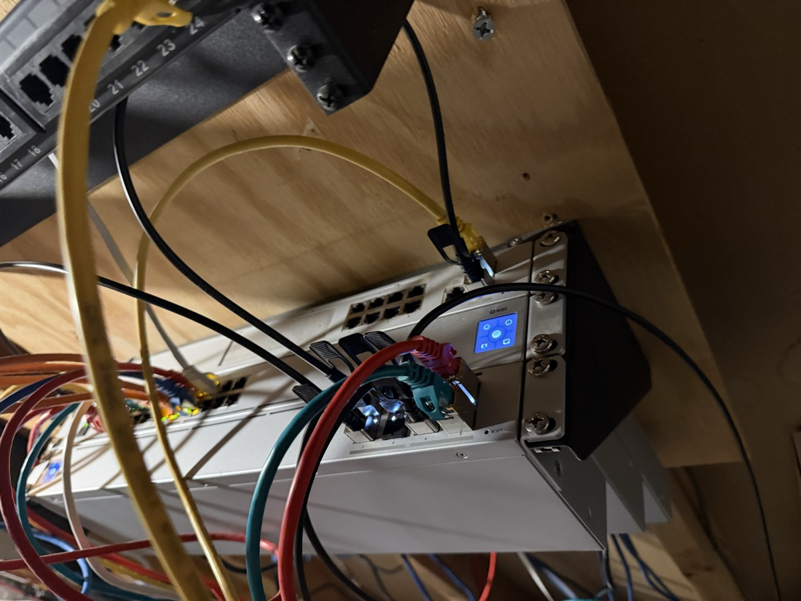
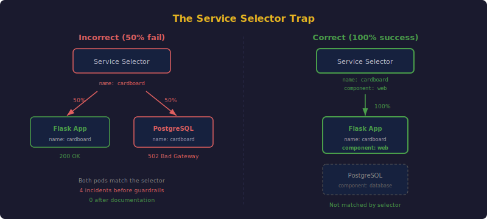
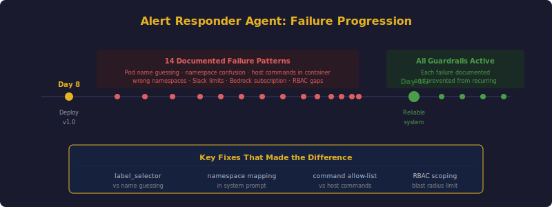
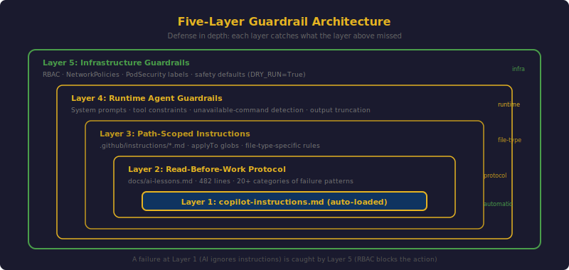

## TL;DR

AI tools have caused multiple production incidents in this cluster. The AI alert responder agent alone generated 14 documented failure patterns before it became reliable. A security scanner deployed by AI applied `restricted` PodSecurity labels to every namespace, silently blocking pod creation for half the applications in the cluster. The service selector trap -- where AI routes 50% of requests to PostgreSQL instead of the application -- appeared in 4 separate incidents before guardrails stopped it. This post catalogs the failure patterns, the five-layer guardrail architecture built to prevent them, and an honest assessment of what still goes wrong.



## The Service Selector Trap: Anatomy of the #1 AI Bug



This is the most documented bug in the cluster. It has its own entry in 4 separate instruction files, and it deserves a full postmortem.

### The Bug

When an application and its PostgreSQL database share a Kubernetes namespace, they both need labels for identification. A common pattern:

```yaml
# Application pod
metadata:
  labels:
    app.kubernetes.io/name: cardboard

# PostgreSQL pod
metadata:
  labels:
    app.kubernetes.io/name: cardboard
```

The AI writes the Service selector using only `app.kubernetes.io/name`:

```yaml
apiVersion: v1
kind: Service
metadata:
  name: cardboard
spec:
  selector:
    app.kubernetes.io/name: cardboard
  ports:
  - port: 8000
```

This selector matches *both* pods. Kubernetes load-balances across all matching pods. Roughly 50% of HTTP requests hit the Flask application (correct), and 50% hit PostgreSQL on port 8000 (which returns garbage or connection reset). The result: intermittent 502 Bad Gateway errors.

### Why AI Keeps Making It

The bug is insidious for three reasons:

1. **It looks correct.** The `app.kubernetes.io/name` label is the standard way to identify an application in Kubernetes. Most tutorials and examples use exactly this pattern.
2. **It works in most cases.** If the database runs in a separate namespace, or uses a different label scheme, the selector is fine. The bug only manifests when both pods share a namespace AND share the same `name` label.
3. **It is intermittent.** The load balancer distributes requests round-robin. Some requests work, some do not. The failure rate depends on the number of pods and the load balancing algorithm. Developers often mistake this for a flaky network or a slow database.

### The Fix

Add `app.kubernetes.io/component` to distinguish pods:

```yaml
# Application pod
metadata:
  labels:
    app.kubernetes.io/name: cardboard
    app.kubernetes.io/component: web

# PostgreSQL pod
metadata:
  labels:
    app.kubernetes.io/name: cardboard
    app.kubernetes.io/component: database

# Service selector (correct)
spec:
  selector:
    app.kubernetes.io/name: cardboard
    app.kubernetes.io/component: web
```

### The Guardrail

This rule appears in 4 files:

**ai-lessons.md** (full explanation):
> Service selector using only `app.kubernetes.io/name` matches BOTH app pod and postgres pod -> 50% of requests get 502 Bad Gateway. ALWAYS include `app.kubernetes.io/component: web`.

**copilot-instructions.md** (anti-pattern #1):
> Service selector trap: When PostgreSQL shares a namespace with the app, Service selector MUST include `app.kubernetes.io/component: web`.

**kubernetes.instructions.md** (path-scoped, activated for YAML files):
> Service selectors MUST include `app.kubernetes.io/component` when PostgreSQL shares the namespace (the #1 recurring 502 bug).

**cardboard/copilot-instructions.md** (project-specific):
> Service selector trap with PostgreSQL -- must include component label.

Four redundant entries. Since adding them: zero recurrences across 3 new applications deployed with the same pattern.



## Alert Responder Agent Failures



The AI-powered alert responder (covered in [a previous post](/posts/2026-02-14-ai-powered-alerts/)) analyzes Prometheus alerts and suggests remediation in Slack. Building a reliable AI agent required 14 documented failure patterns and fixes. Here is the progression.

### Guessing Pod Names

**The failure**: Job pods have random suffixes. When investigating a failed `postgres-backup` CronJob, the agent fabricated the pod name `postgres-backup-29520495-xxxxxx` and ran `kubectl logs postgres-backup-29520495-xxxxxx -n cardboard`. NotFound.

**The fix**: Added a `label_selector` parameter to the `kubectl_get` tool. Instead of guessing names, the agent queries `pods -l job-name=postgres-backup-29520495` and gets the actual pod name from the result.

### Namespace Confusion

**The failure**: An alert fired for the `cardboard` namespace. The agent analyzed the alert, correctly identified it as a database connection issue, then investigated pods in the `trade-bot` namespace. The namespaces have similar architectures (Flask + PostgreSQL), and the agent confused them.

**The fix**: Added explicit "Namespace Discipline" rules to the system prompt:

```
CRITICAL: Always use the namespace from the alert. Never investigate pods
in a different namespace. Common confusion pairs:
- trade-bot vs cardboard (both Flask + PostgreSQL)
- longhorn vs longhorn-system (use longhorn-system)
- monitoring vs kube-system (Prometheus is in monitoring)
```

### Wrong Infrastructure Namespace

**The failure**: When investigating a Longhorn volume issue, the agent queried `kubectl get pods -n longhorn`. The namespace was empty. Longhorn runs in `longhorn-system`.

**The fix**: Added an explicit namespace mapping to the system prompt:

```
Infrastructure namespaces:
- Longhorn: longhorn-system
- Traefik: kube-system
- Monitoring: monitoring
- MetalLB: metallb-system
- cert-manager: cert-manager
```

### Running Host Commands in a Container

**The failure**: The agent tried `journalctl -u kubelet`, `systemctl status k3s`, `netstat -tlnp`, and `ps aux` -- none of which exist in the alert-responder pod (Python 3.12-slim with only kubectl, helm, curl, and git). It wasted 5+ tool calls per session trying host-level commands that all returned "command not found."

**The fix**: Added unavailable-command detection to the tool layer. The agent's `run_shell` tool description now explicitly states container limitations:

```
This tool executes commands inside the alert-responder pod (Python 3.12-slim).
Available: kubectl, helm, curl, git, python3
NOT available: journalctl, systemctl, service, ps, top, netstat, ss, ip,
iptables, tcpdump, nmap. Use kubectl commands to inspect cluster resources.
```

### Other Agent Failures

- **Slack Block Kit 3000-char limit**: LLM-generated remediation analysis exceeded the limit. Fix: truncate to 2800 characters before inserting into blocks.
- **Bedrock tool-use subscription**: Claude models on Bedrock returned `AccessDeniedException` when `toolConfig` was included, despite showing "Access granted" in the console. Fix: use Nova Micro for agentic workloads. Claude on Bedrock requires an explicit AWS Marketplace subscription for tool-use.
- **ConfigMap env vars override code defaults**: Changed Python code defaults without updating the Kubernetes ConfigMap. The ConfigMap value took precedence. Fix: always update both.
- **Slack bot `not_in_channel`**: Bot could not post to a channel it had not been invited to. Fix: `/invite @BotName` after deployment.
- **Bedrock Converse API `toolResult` wrapper**: Tool results required a specific wrapper structure (`toolResult` key with `toolUseId`, `content`, and `status`). Putting the fields directly in the content array caused `ParamValidationError`.

The progression: initial deployment on day 8, 14 documented failures over the next week, and a reliable system by day 16. Each failure permanently improved the agent.

## Safety Defaults and Blast Radius

AI-driven systems need the same operational safeguards as any production system. The principle: every automated system gets a "blast radius" limit.

### Trade Bot: Default-Safe

The trade bot uses Claude Sonnet 4.5 on AWS Bedrock for market analysis. Its copilot-instructions file mandates:

```markdown
- DRY_RUN mode: DRY_RUN=True is the default. Real orders are NEVER
  placed unless explicitly disabled.
- Paper trading: PAPER_TRADING=True uses simulated execution.
  Never disable in development.
- PDT compliance: All trading logic must respect the Pattern Day
  Trader rule (max 3 day trades per 5 business days).
```

The AI cannot accidentally execute real trades. `DRY_RUN=True` is the default in code, in the Kubernetes ConfigMap, and in the CI/CD pipeline. Disabling it requires changing all three -- a deliberate friction that prevents accidents.

### Proxmox Watchdog: Threshold Before Action

The Proxmox watchdog automatically power-cycles unresponsive hosts using smart power strips. An automated power-cycler without safeguards would be catastrophic. The guardrails:

- **Consecutive failure threshold**: The host must fail 5 consecutive health checks before triggering a power cycle. A single failed API call does nothing.
- **Cooldown period**: After power-cycling a host, the watchdog waits 5 minutes before checking it again, giving the host time to boot.
- **Network policy**: The watchdog pod's egress is restricted to only the Proxmox host IPs and the Kasa strip IP. It cannot reach anything else.
- **Slack notifications**: Every power cycle sends a Slack alert.
- **Degraded mode**: If the Kasa smart strip is unreachable, the watchdog continues monitoring but cannot power-cycle. It does not crash.

### Alert Responder: RBAC Scoping

The alert responder can execute kubectl commands suggested by the AI. Without RBAC constraints, this would be terrifying. The service account is scoped to:

- Read access to pods, events, and logs in application namespaces
- No delete permissions for any resource
- No access to secrets
- Specific namespace restrictions (cannot see `kube-system` internals)

### The Security Scanner Incident

The most dramatic AI-caused incident was the security scanner over-labeling. A security scanning service deployed by AI labeled ALL application namespaces with `pod-security.kubernetes.io/enforce: restricted`:

```bash
# What the scanner did
kubectl label namespace cardboard pod-security.kubernetes.io/enforce=restricted
kubectl label namespace trade-bot pod-security.kubernetes.io/enforce=restricted
kubectl label namespace home-assistant pod-security.kubernetes.io/enforce=restricted
kubectl label namespace dev-workspace pod-security.kubernetes.io/enforce=restricted
```

The `restricted` PodSecurity standard blocks many common pod configurations. The impact:

| Namespace | Requires | restricted Allows | Result |
|-----------|----------|-------------------|--------|
| cardboard | PostgreSQL (baseline) | No | Pods blocked |
| trade-bot | PostgreSQL (baseline) | No | Pods blocked |
| home-assistant | hostNetwork (privileged) | No | Pods blocked |
| dev-workspace | Docker-in-Docker (privileged) | No | Pods blocked |

Pods did not get evicted immediately -- existing pods continued running. But as soon as any pod restarted (crash, node drain, scaling), it could not be recreated. Deployments showed replica count > 0 but 0 pods running. The symptom was silent: no error events until you checked `kubectl get pods`.

The fix required manually relabeling each namespace with the correct PodSecurity level:

```bash
kubectl label namespace cardboard pod-security.kubernetes.io/enforce=baseline --overwrite
kubectl label namespace home-assistant pod-security.kubernetes.io/enforce=privileged --overwrite
```

The guardrail: PodSecurity labels are now baked directly into the namespace YAML in the repository. Re-applying manifests restores the correct labels even if something overwrites them.

## The ConfigMap Trap and Other Infrastructure Gotchas

Beyond the service selector and agent failures, several other patterns emerged as AI-specific mistakes.

### ConfigMap Immutability

The AI writes Kubernetes manifests that mount ConfigMaps directly over file paths:

```yaml
volumeMounts:
- name: config
  mountPath: /app/config.yaml
  subPath: config.yaml
```

This works until an init container needs to modify that file. ConfigMap mounts are read-only. The init container gets "Resource busy" when trying to write. This happened with code-server, Home Assistant, and the alert responder.

The fix: mount to `/tmp/config-template/` and copy to the target path in a command override:

```yaml
command: ["/bin/sh", "-c"]
args:
- cp /tmp/config-template/config.yaml /app/config.yaml && exec /app/start.sh
```

### ARC Label Replacement

GitHub Actions Runner Controller has a subtle behavior: the `labels` field in the runner configuration *replaces* the default labels entirely. If you set `labels: [k3s, linux, amd64]`, the default `self-hosted` label disappears. Jobs with `runs-on: [self-hosted, k3s, linux, amd64]` never match.

The AI makes this mistake because `labels` in every other Kubernetes context is additive. ARC is the exception. The fix: always include `self-hosted` explicitly.

### ECR Token Expiry

AWS ECR authentication tokens expire after 12 hours. The AI writes CI/CD pipelines that refresh the pull secret during deployment -- which works. But daily CronJobs (etcd backups, PostgreSQL backups) that run 12+ hours after the last deployment fail silently because the pull secret expired.

The fix: a dedicated ECR token refresh CronJob that runs every 6 hours:

```yaml
apiVersion: batch/v1
kind: CronJob
metadata:
  name: ecr-token-refresh
spec:
  schedule: "0 */6 * * *"
```

### GPU Taints Over-Constraining

The AI added `gpu=true:NoSchedule` taints to agent nodes with Intel UHD 630 GPUs. The intent was to reserve GPU nodes for GPU workloads (Jellyfin, Tdarr). The effect was blocking *all* non-GPU pods from scheduling on those nodes. With only 4 non-tainted nodes (3 control-plane + 1 arm64), the cluster was resource-exhausted.

GPU workloads already use `nodeSelector: gpu: intel-uhd-630` to target GPU nodes. The taints were redundant and harmful. Removing them resolved the scheduling pressure.

## Guardrail Architecture



The guardrails are structured in five layers, from automatic to manual:

### Layer 1: Automatic Context Loading

`copilot-instructions.md` and `CLAUDE.md` are read automatically by GitHub Copilot and Claude Code respectively. The AI gets project context without being asked. This layer catches the most common mistakes because it is always active.

### Layer 2: Read-Before-Work Protocol

The Memory Protocol requires reading `docs/ai-lessons.md` before infrastructure changes. This is not automatic -- it depends on the AI following the protocol instruction. But because the instruction is in Layer 1 (automatically loaded), the AI reads the protocol, then reads the failure database.

### Layer 3: Path-Scoped Rules

`.github/instructions/*.md` files activate based on file type. When editing Kubernetes manifests, the AI sees Kubernetes-specific rules. When editing Terraform, it sees provider-specific rules. This reduces noise and increases signal for the specific task.

### Layer 4: Runtime Agent Guardrails

AI agents running inside the cluster (alert responder, security scanner) have their own guardrails:

- System prompts with explicit namespace mappings
- Tool descriptions listing unavailable commands
- Tool parameter validation (label selectors instead of name guessing)
- Output truncation for API limits

### Layer 5: Infrastructure Guardrails

The final layer is Kubernetes infrastructure itself:

- RBAC restricts which resources AI agents can access
- NetworkPolicies restrict which endpoints AI agents can reach
- PodSecurity labels are version-controlled in namespace manifests
- Safety defaults in code (`DRY_RUN=True`, consecutive failure thresholds)

The layers are defense in depth. A failure at Layer 1 (AI ignores instructions) is caught by Layer 5 (RBAC blocks the action). A failure at Layer 4 (agent guesses a pod name) is caught by Kubernetes returning NotFound instead of deleting something.

## What Still Goes Wrong

Honesty requires acknowledging the limitations.

### Novel Problems Have No Guardrails

The guardrail system only prevents *known* failure patterns. When the AI encounters a genuinely new problem -- a Mellanox firmware flash bricking a NIC, a Wiki.js GraphQL mutation that hangs forever, a kube-router iptables chain silently dropping traffic -- there is no documentation to prevent mistakes. The first encounter with a novel problem is always unguarded.

The mitigation is the feedback loop: novel problems get documented, and the documentation prevents recurrence. But the first instance is always costly.

### Context Window Limits

The `ai-lessons.md` file is 482 lines. Some AI tools have context window limits that may truncate long files. If the critical entry for the current task is at line 400, it might not be loaded. Path-scoped instructions help by keeping individual files short, but the main lessons file is inherently large.

### AI Sometimes Ignores Documented Patterns

Even when the guardrail text is loaded and the AI has clearly read it, it occasionally proceeds with the anti-pattern anyway. This is most common when the AI is mid-task and has built up significant context about the current approach. The documented rule says "do X" but the AI's reasoning about the current specific situation overrides the general rule.

This is rare but not zero. It is the AI equivalent of a developer who knows the coding standard but takes a shortcut under time pressure.

### Cross-Repository Consistency

Maintaining 5 separate `copilot-instructions.md` files requires manual effort. When a new anti-pattern is discovered in `home_k3s_cluster`, the relevant entries must be manually propagated to other repositories that might encounter the same pattern. There is no automation for this.

## Further Reading

- Simon Willison writes extensively about [working with LLMs for code](https://simonwillison.net/2025/Mar/11/using-llms-for-code/), including the critical importance of validating AI output -- a theme that resonates with the guardrail architecture described here.
- Honeycomb published [AI-Powered Observability: From Reactive to Predictive](https://www.honeycomb.io/blog/ai-powered-observability-from-reactive-to-predictive), where Ranbir Chawla advises focusing AI on operational toil rather than replacing developers -- precisely where the alert responder agent provides value.
- Mitchell Hashimoto's [AI adoption journey](https://mitchellh.com/writing/my-ai-adoption-journey) describes the progression from skepticism to daily usage, including the trust calibration that maps to the guardrail layering approach.
- Honeycomb's [AI in Production Is Growing Faster Than We Can Trust It](https://www.honeycomb.io/blog/ai-in-production-is-growing-faster-than-we-can-trust-it) covers the observability challenges for agentic AI workloads -- hallucination detection, drift, and cost tracking -- all of which apply to the alert responder agent.

## Lessons Learned

1. **AI tools need the same operational guardrails as any production system.** Safety defaults, blast radius limits, RBAC scoping, and monitoring are not optional. An AI agent with unrestricted kubectl access is an incident waiting to happen.
2. **The first encounter with a novel problem is always unguarded.** Guardrails only prevent known patterns. The value of the documentation system is in preventing recurrence, not preventing first occurrence. Accept this and invest in the feedback loop.
3. **Redundancy in guardrails is intentional.** The service selector trap appears in 4 files. This is defense in depth, not poor organization. Critical rules must be encountered regardless of which entry point the AI uses.
4. **AI agents in production need explicit tool constraints.** Listing available commands, requiring label-based pod lookups instead of name guessing, adding namespace discipline rules -- these are not nice-to-haves. Without them, agents waste tool calls on impossible commands and investigate the wrong resources.
5. **Safety defaults must be in code, config, and pipeline.** The trade bot's `DRY_RUN=True` in Python code would not be enough if the Kubernetes ConfigMap set it to False. Defense in depth means the same safety default in every layer.
6. **Silent failures are the most dangerous.** The security scanner over-labeling incident, the ECR token expiry on CronJobs, and the MetalLB pool annotation -- all failed silently. No error logs, no alerts, just pods that quietly could not be created. Build monitoring for what *should* exist, not just what *does* exist.
7. **The AI failure arc is predictable.** Initial deployment, 10-20 failures over the first week, then reliability. The alert responder went through 14 documented patterns. Budget for this learning period and document every failure. The documentation is the product.
8. **Honest limitations matter more than claims of reliability.** AI tools are not reliable by default. They are made reliable through guardrails, documentation, and operational discipline. Pretending otherwise leads to incidents. Acknowledging the limitations leads to better architecture.
