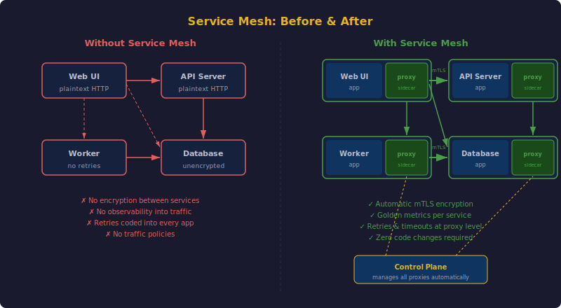
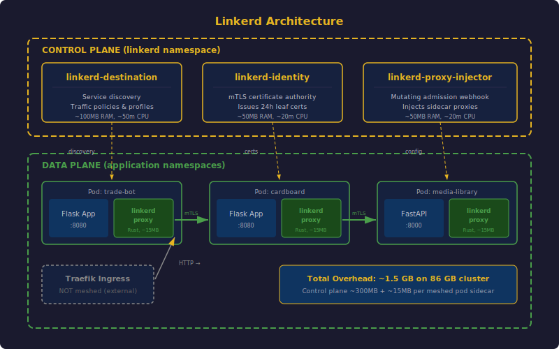
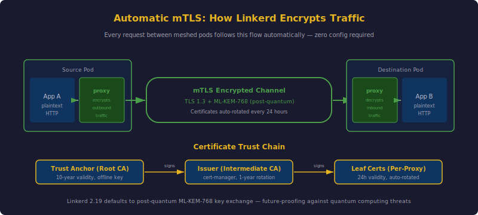
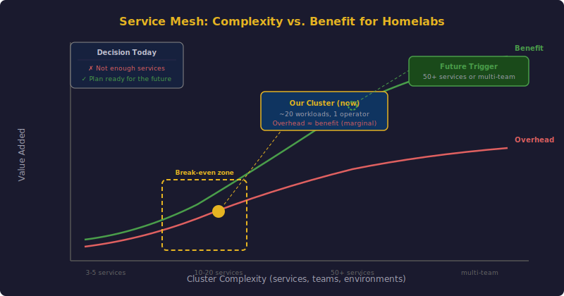

## TL;DR

I spent time evaluating Linkerd — the CNCF graduated service mesh — for my homelab k3s cluster. The conclusion: it's an impressive piece of engineering with genuinely useful features like automatic mTLS, post-quantum cryptography, and per-service observability. But for a cluster with ~20 workloads and a single operator, the operational overhead outweighs the benefits today. I've written a complete deployment plan so I can adopt it quickly when the cluster grows to the point where it makes sense.

This post covers what a service mesh actually does, what makes Linkerd different, the latest features in version 2.19, and the honest complexity analysis that led to "not yet."

---

## What Is a Service Mesh?

A service mesh is an infrastructure layer that handles service-to-service communication within a cluster. Instead of building networking concerns (encryption, retries, observability, access control) into every application, a mesh handles them transparently at the network level.

The key mechanism is the **sidecar proxy**. Every pod in the mesh gets a tiny proxy container injected alongside the application container. All inbound and outbound traffic flows through this proxy, which handles encryption, collects metrics, enforces policies, and manages retries — without the application knowing.

The "before" side is what most Kubernetes clusters look like: services talk to each other over plaintext HTTP, there's no visibility into inter-service traffic, every application has to implement its own retry logic, and there's no consistent way to enforce traffic policies.

The "after" side shows the mesh in action: every pod gets a lightweight proxy sidecar, all traffic between proxies is encrypted with mTLS, and a central control plane manages configuration, certificates, and policy for all proxies simultaneously.

**The core value proposition**: move networking concerns out of application code and into infrastructure that's managed uniformly across the entire cluster.

---

## Why Linkerd Specifically?

There are several service mesh options in the Kubernetes ecosystem. Istio is the elephant in the room — massively featured, widely adopted, and notoriously complex. Cilium offers mesh capabilities built into its eBPF-based CNI. Consul Connect from HashiCorp takes a different architectural approach.

Linkerd stands out for a few reasons that matter for homelabs:

**It's ultralight.** Linkerd's data plane proxy (`linkerd2-proxy`) is written in Rust and purpose-built for Linkerd. Each sidecar uses roughly 10-20 MB of RAM. Compare that to Istio's Envoy sidecars at 30-50 MB each. On a cluster with 86 GB of total worker RAM, this isn't life-or-death, but it reflects a design philosophy of minimalism.

**It's a CNCF graduated project.** That means it went through the full CNCF maturity process — the same graduation that Kubernetes, Prometheus, and containerd achieved. It's fully open source under Apache v2.

**The control plane is tiny.** Three components, roughly 300 MB total:

| Component | Purpose | Resources |
|-----------|---------|-----------|
| `linkerd-destination` | Service discovery, traffic policies | ~100 MB RAM |
| `linkerd-identity` | mTLS certificate authority | ~50 MB RAM |
| `linkerd-proxy-injector` | Sidecar injection via admission webhook | ~50 MB RAM |

For comparison, a full Istio installation can consume 1-2 GB for the control plane alone.

**Zero-config mTLS.** The moment you mesh a workload, all traffic between meshed pods is automatically encrypted. No certificate configuration, no TLS termination setup, no application changes. It just works.

---

## How Linkerd Fits Into a k3s Cluster

My cluster runs k3s on 8 nodes: 3 server nodes (control plane), 4 amd64 worker agents, and 1 arm64 Mac Mini running a Lima VM. Traefik is the ingress controller (bundled with k3s), MetalLB handles LoadBalancer IPs, Longhorn provides distributed storage, and cert-manager manages TLS certificates.

Linkerd slots in cleanly without conflicting with any of these:

Key architectural details:

- **k3s compatibility is native.** k3s supports `MutatingAdmissionWebhook` (required for sidecar injection), uses Flannel VXLAN for CNI (fully compatible), and its built-in nftables/iptables don't conflict with Linkerd's L7 proxying inside pod network namespaces.

- **Traefik stays unmeshed.** The ingress controller operates outside the mesh. It terminates TLS from external clients, then forwards plaintext HTTP into the cluster. Linkerd's sidecar on the destination pod transparently upgrades this to mTLS between meshed pods. No Traefik config changes needed.

- **The control plane fits anywhere.** At ~300 MB total, it's lighter than a single Grafana instance. The scheduler can place it on any amd64 worker without special node affinity.

- **cert-manager handles rotation.** Since cert-manager is already deployed for Let's Encrypt wildcard certs, it would also manage Linkerd's intermediate issuer certificate — automating what would otherwise be manual annual certificate rotation.

---

## What's New in Linkerd 2.19

The latest stable release, Linkerd 2.19 (October 2025), introduced features that genuinely push the state of the art:

### Post-Quantum Cryptography

This is the headline feature. Linkerd 2.19 switched its core cryptographic module from `ring` to `aws-lc` and added default support for the **ML-KEM-768 key exchange algorithm** — a post-quantum algorithm standardized by NIST. All communication between meshed pods now uses TLS 1.3 with AES_256_GCM and ML-KEM-768 by default.

Why does this matter? Current encryption is theoretically vulnerable to future quantum computers capable of breaking RSA and elliptic-curve cryptography. ML-KEM-768 is designed to resist both classical and quantum attacks. Linkerd adopted it proactively, and the TLS cipher, key exchange, and signature algorithms are now exported as part of the standard metrics suite.

### Native Sidecar Support (Beta)

Kubernetes native sidecars (graduated in K8s 1.29) fix longstanding issues with the traditional init-container sidecar model — particularly around Job pods hanging indefinitely and race conditions during container startup. Linkerd 2.19 promoted native sidecar support from alpha to beta with the annotation `config.beta.linkerd.io/proxy-enable-native-sidecar`.

### Simplified Image Management

The `proxy-init` image was merged into the `proxy` image, reducing the number of container images to manage and shrinking overall image size. One less image to pull, cache, and track.

### Direct OpenTelemetry Tracing

The `linkerd-jaeger` extension was removed in favor of native OpenTelemetry support. Tracing is now configured directly via Helm values (`controller.tracing.enable` and `controller.tracing.collector.endpoint`), and spans include semantic convention labels like `user-agent.original` and `http.request.header.content-type`. OpenCensus support was also dropped.

### New Metrics

Several new histograms and counters were added: `inbound_requests` for total inbound request counts, `inbound_http_response_frame_size_bytes` and `inbound_grpc_response_frame_size_bytes` for frame size histograms, and the `workload_subscribers` metric (replacing the higher-cardinality `ip_port_subscribers`).

---

## The Full Feature Set

Beyond the 2.19 additions, Linkerd's current feature matrix is comprehensive:

- **Automatic mTLS** — zero-config encryption for all meshed traffic
- **Golden metrics** — request rate, success rate, and latency for every service automatically
- **Retries and timeouts** — configurable per-route via HTTPRoute resources
- **Load balancing** — L7 load balancing across endpoints (better than kube-proxy's L4)
- **Authorization policy** — restrict which services can talk to which
- **Traffic splitting** — canary deployments and blue/green routing
- **Rate limiting** — local HTTP rate limiting to protect services
- **Multi-cluster** — transparent cross-cluster service communication
- **Egress monitoring** — visibility and policy for traffic leaving the cluster
- **Fault injection** — programmatic failure injection for chaos testing
- **Gateway API support** — uses standard Kubernetes Gateway API resources
- **IPv6 and dual-stack** — full compatibility
- **Mesh expansion** — extend the mesh to non-Kubernetes workloads
- **Topology-aware routing** — route based on node zone labels

---

## Why I'm Not Deploying It (Yet)

Here's the honest analysis. I ran through the full evaluation — architecture design, resource planning, rollout strategy, failure scenarios, removal procedures. The plan is complete and documented. But execution doesn't make sense today.

### The Complexity Equation

**Current state:**
- ~20 workloads across ~20 namespaces
- Single operator (me)
- No multi-team access control requirements
- Services mostly talk to their own PostgreSQL and external APIs
- Limited east-west (service-to-service) traffic

**What Linkerd would add:**
- ~1.5 GB total memory overhead (control plane + sidecars)
- Certificate lifecycle management (trust anchor, issuer rotation)
- A new component to monitor, upgrade, and debug
- Injection coordination during deployments
- Another layer of networking to troubleshoot when things break

**The problem**: most of the mesh's value comes from managing complexity at scale — service-to-service traffic policies, per-endpoint observability across dozens of microservices, mTLS between teams that don't trust each other. My cluster doesn't have these problems yet.

### What Would Change My Mind

I'd deploy Linkerd when any of these triggers are met:

1. **Service count exceeds ~50**, with meaningful east-west traffic between them
2. **Multiple operators or teams** need RBAC-enforced traffic policies
3. **Compliance requirements** mandate encrypted service-to-service traffic with audit trails
4. **Canary deployments** become necessary for safe rollouts
5. **Observability gaps** — I can't debug service interactions with current Prometheus/Loki setup

The plan is written, tested on paper, and ready. When the trigger fires, deployment is a matter of following the runbook.

### The Auto Brand Factor

My [auto_brand project](/posts/auto-brand-introduction/) (the AI video factory) comes closest to needing a mesh. It's a proper microservice architecture with 7 services communicating over NATS JetStream: orchestrator, LLM service, video service, publisher, analytics, experimentation, and web UI. If auto_brand grows to production scale with real traffic, that's likely the catalyst that tips the complexity equation in Linkerd's favor.

---

## The Bottom Line

Linkerd is the right choice *when the time comes*. It's the lightest, safest, and most operationally simple mesh available. Post-quantum cryptography by default is forward-thinking. Native CNCF governance means it won't get rug-pulled by a vendor. The Rust proxy is fast and memory-efficient.

But a service mesh is infrastructure that manages infrastructure. Adding it to a cluster that doesn't have the problems it solves is adding complexity for its own sake — the opposite of good engineering.

The plan is documented. The triggers are defined. When the cluster outgrows its current simplicity, Linkerd will be the first addition.

---

*Have questions about service mesh evaluation for your homelab? Find me on [GitHub](https://github.com/zolty-mat).*
